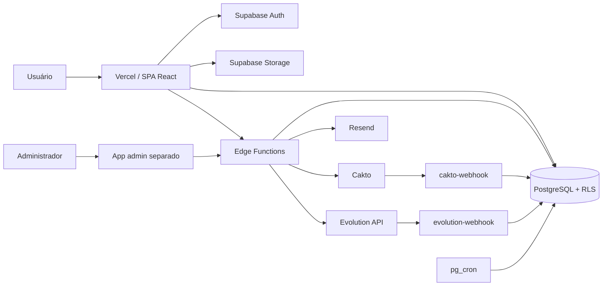

# Arquitetura

## Visão geral

O Aflyo é uma SPA, não uma aplicação Next.js. O browser renderiza React, usa Supabase Auth e PostgREST para operações cobertas por RLS e chama Edge Functions para operações privilegiadas ou integrações externas. O painel administrativo é uma aplicação separada em `admin/` e acessa a função `admin-api`.

## Estrutura

| Caminho | Responsabilidade |
|---|---|
| `src/pages/` | telas e rotas da SPA |
| `src/components/` | componentes de produto e UI |
| `src/context/` | sessão, perfil e notificações globais |
| `src/hooks/` | carregamento e regras de interface |
| `src/services/` | acesso às tabelas via cliente Supabase |
| `src/lib/` | integrações, despacho, formatação e utilitários |
| `src/config/` | catálogo, limites e flags do produto |
| `supabase/functions/` | Edge Functions Deno |
| `supabase/migrations/` | evolução versionada do banco |
| `admin/` | painel administrativo independente |
| `browser-extension/` | extensão do Mercado Livre |
| `scripts/` | verificações de regressão e consistência |

## Fluxo de requisição

Não existem middleware, Server Components ou Server Actions de Next.js. O equivalente implementado é:

1. `src/App.tsx` inicializa a sessão e monta o `BrowserRouter`.
2. Rotas privadas passam por `ProtectedRoute`; o callback OAuth usa PKCE e é liberado antes da consulta inicial de sessão.
3. Componentes e serviços usam o cliente de `src/lib/supabase.ts`, com JWT do usuário e RLS.
4. Operações com segredo ou privilégio chamam uma Edge Function com `Authorization: Bearer <JWT>`.
5. Edge Functions validam o JWT com a chave anônima e usam `service_role` somente no servidor quando necessário.

A Vercel reescreve as rotas da SPA para `index.html` conforme `vercel.json`.

## Autenticação e multi-tenancy

- Supabase Auth mantém a sessão no `localStorage`, sob `sb-aflyo-auth`, com migração da chave legada `sb-linkoferta-auth`.
- Os registros de tenant usam `user_id`; `profiles.id` corresponde a `auth.users.id`.
- Policies RLS normalmente exigem `auth.uid() = user_id`.
- Conteúdo público sai das views sanitizadas `public_profiles` e `public_offers` e das RPCs de redirecionamento.
- O painel admin exige conta ativa, MFA `aal2` e permissão RBAC em `admin-api`.

## Integrações

- **Supabase:** Auth, Postgres, RLS, Storage, Realtime, Edge Functions e `pg_cron`.
- **Cakto:** criação/cancelamento de pagamento e webhook de assinatura. Colunas `provider_*` preservam abstração histórica; Stripe não é o PSP ativo.
- **Evolution API:** instâncias, grupos e webhook do WhatsApp.
- **Telegram/Discord:** despacho iniciado pelo cliente em partes do fluxo; o `public-api/dispatch` também coordena canais.
- **Resend:** e-mails transacionais disparados por funções e hooks.
- **Bitly:** token ainda é referenciado como fallback no enriquecimento/public API; o encurtador próprio é a estratégia vigente.
- **LLM:** nenhuma integração com LLM foi encontrada no código atual.

## Decisões relevantes

- SPA Vite e backend Supabase, sem servidor Next.js.
- RLS é a fronteira primária entre tenants; `service_role` nunca pertence ao cliente.
- Limites vivem em `plan_limits` e têm espelho tipado em `src/config/plans.ts`.
- Ofertas não expiram automaticamente; a migration `20260903180000_disable_offer_ttl.sql` desativou o TTL.
- Checkout é apenas mensal no produto, embora o banco preserve `yearly` para compatibilidade.

