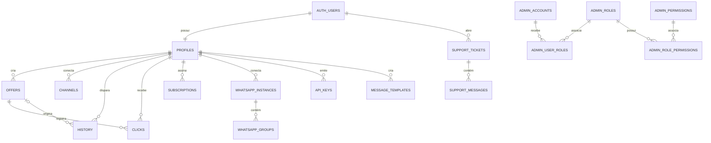

# Banco de dados

PostgreSQL no Supabase é a fonte dos dados e de parte relevante das regras. O schema inicial ainda aparece em scripts SQL na raiz, enquanto a evolução versionada está em `supabase/migrations/`. Em caso de divergência, leia as migrations em ordem; scripts soltos não provam que foram aplicados.

## Modelo principal

## Tabelas e colunas principais

| Tabela | Colunas centrais | Finalidade |
|---|---|---|
| `profiles` | `id`, `email`, `username`, `plan`, `account_status`, `trial_*`, `bio`, `public_url` | perfil, tenant e entitlement |
| `offers` | `id`, `user_id`, `name`, preços, `discount`, `affiliate_link`, `marketplace`, `short_code`, `status`, `clicks` | catálogo do afiliado |
| `channels` | `id`, `user_id`, `type`, `identifier`, `status`, `members` | destinos WhatsApp/Telegram/Discord |
| `history` | `user_id`, `offer_id`, `channels`, `channel_count`, `failure_count`, `status`, `sent_at` | auditoria de disparos |
| `clicks` | `offer_id`, `user_id`, `source`, `created_at` | eventos de clique |
| `user_settings` | `user_id` e preferências | configurações individuais |
| `bot_configs` | `user_id`, estado, horários, grupos de origem, credencial protegida | automação |
| `whatsapp_instances` | `user_id`, identificação Evolution, status | conexões WhatsApp |
| `whatsapp_groups` | instância, grupo, seleção | grupos sincronizados |
| `message_templates` | `user_id`, nome, conteúdo, tipo | modelos de mensagem |
| `api_keys` | `user_id`, hash/segredo protegido, prefixo, status | acesso à `public-api` |
| `subscriptions` | `user_id`, `provider_subscription_id`, plano/ciclo/status, valor, período, graça | cobrança recorrente |
| `pending_subscriptions` | e-mail, plano, período, payload | eventos ainda sem usuário associado |
| `webhook_events` | id externo, tipo, payload, processado em | idempotência de webhook |
| `plan_limits` | plano e capacidades/limites | fonte de direitos por plano |
| `support_tickets` | número, usuário, título, status, prioridade, responsável | atendimento |
| `support_messages` | ticket, autor, papel, conteúdo | conversa do ticket |
| `email_log` | destinatário, template, estado, metadados | rastreio transacional |
| `admin_*` | contas, papéis, permissões, vínculos, auditoria, notas e tags | RBAC e operação admin |
| `system_flags`, `system_announcements` | chave/valor e anúncios | configuração operacional |
| `security_email_blocklist` | e-mail normalizado e motivo | bloqueio de cadastro/acesso |
| `maintenance_runs` | job, execução, métricas | histórico de manutenção |

## Estados e enums por CHECK

- `profiles.plan`: `free`, `starter`, `pro`, `enterprise`.
- `profiles.account_status`: `trialing`, `active`, `expired`, `canceled`, `suspended`.
- `offers.status`: `active`, `paused`, `draft`.
- `channels.type`: `whatsapp`, `telegram`, `discord`; status base `connected`, `disconnected`, `error`.
- `subscriptions.status`: `active`, `past_due`, `canceled`, `expired`; ciclo `monthly`, `yearly`.
- `support_tickets.status`: `open`, `in_progress`, `resolved`, `closed`; prioridade `low`, `normal`, `high`, `urgent`.
- `support_messages.author_role`: `user`, `support`, `admin`.
- `api_keys.status`: `active`, `revoked`.

## RLS resumida

| Tabela/grupo | Leitura | Escrita |
|---|---|---|
| `profiles` | próprio usuário; público via view sanitizada | próprio usuário apenas nas colunas concedidas; plano/estado por serviço/admin |
| `offers` | dono; público via `public_offers` | dono (`user_id = auth.uid()`) |
| `channels`, `history`, `user_settings`, templates | dono | dono |
| `clicks` | dono da oferta | insert anônimo; triggers derivam proprietário e contador |
| `subscriptions` | dono | webhook/admin com `service_role` |
| `pending_subscriptions`, `webhook_events` | sem policy de cliente | serviço |
| `plan_limits` | qualquer autenticado | apenas `service_role` |
| `whatsapp_*` | dono | dono ou função privilegiada, conforme operação |
| `api_keys` | dono | funções dedicadas de gerar/revelar/revogar |
| `support_tickets` | dono | policy atual é `FOR ALL` do dono |
| `support_messages` | usuário do ticket | insert como papel `user`; admin usa serviço |
| `admin_*`, segurança e sistema | admin autorizado | RPC/`admin-api`; logs têm mutação bloqueada |
| `storage.objects` do produto | proprietário/pasta do usuário | proprietário, conforme policies `aflyo_storage_owner_*` |

As migrations `20260831010000` e `20260920160000` substituem acesso público direto amplo por views/grants específicos. Não restaure policies antigas de SELECT público nas tabelas base.

## Funções e triggers relevantes

- `handle_new_user`/`profiles_trial_defaults`: cria/completa perfil e defaults do trial.
- `has_active_access`: decisão canônica de acesso.
- `enforce_whatsapp_instance_limit`, `enforce_channel_limit`, `enforce_source_group_limit`: direitos por plano.
- `offers_validate_affiliate_link`: bloqueia protocolos inválidos.
- `clicks_set_offer_owner` e `clicks_increment_offer`: derivam tenant e incrementam contador.
- `bot_configs_block_reactivate`: impede reativação sem acesso.
- `get_bot_config_api_key`/`set_bot_config_api_key`: acesso controlado à credencial do bot.
- `update_ticket_on_message`: atualiza datas do ticket.
- `enqueue_transactional_email` e triggers de boas-vindas: fila/log de e-mail.
- RPCs `admin_*`: leituras e mutações administrativas com auditoria.

## Views e interfaces públicas

- `public_profiles`: somente campos aprovados da vitrine.
- `public_offers`: ofertas ativas e campos públicos.
- `resolve_offer_redirect` e `list_public_offers`: resolução/listagem sem expor tabela completa.

## Exclusão e integridade

- `profiles.id` referencia `auth.users` com `ON DELETE CASCADE`; várias tabelas do tenant acompanham a exclusão do perfil.
- `offers.user_id` usa cascade; `history.offer_id` usa `ON DELETE SET NULL`; `clicks.offer_id` usa cascade.
- `support_tickets.user_id` usa cascade; mensagens usam cascade pelo ticket e `author_id ON DELETE SET NULL`.
- `admin_audit_log` é imutável por trigger.
- Valores monetários usam `NUMERIC/DECIMAL(10,2)` e datas operacionais usam `TIMESTAMPTZ`.

## Migrations

Crie arquivos `supabase/migrations/AAAAMMDDHHMMSS_descricao.sql`. Uma migration deve incluir schema, RLS, grants, índices e migração de dados necessária. Teste em banco descartável antes de homologação e produção.

O repositório não contém `supabase/config.toml`; [NÃO CONFIRMADO] não há como reproduzir, apenas com os arquivos atuais, o comando exato usado para aplicar migrations. O caminho comum do CLI é `supabase db push` após vincular o projeto, mas confirme o processo operacional antes de executá-lo.

